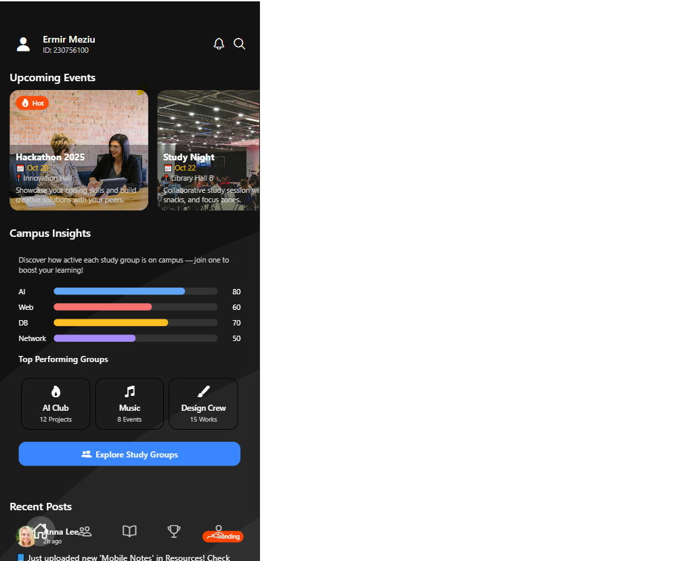
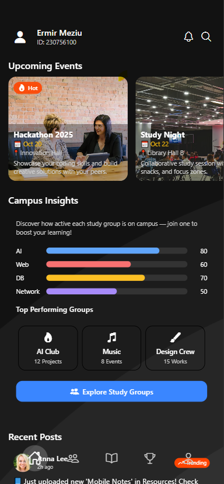
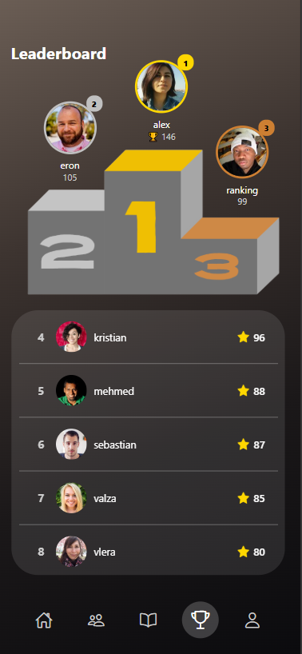
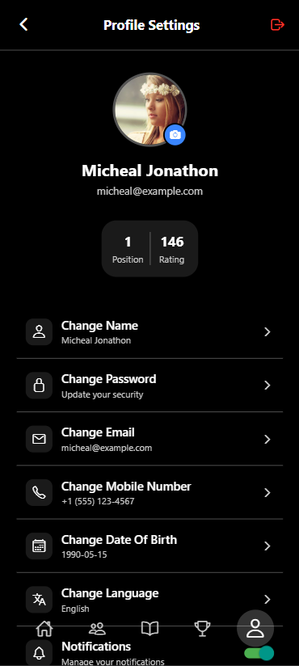

# 🎓 GoCampus

**GoCampus** is a mobile application built with **Expo / React Native**, designed to help students discover and join campus **groups**, keep track of **upcoming events**, view **leaderboards**, access **resources**, and manage their **profile** — all in one place.  
The goal of this project is to make it easy for students to quickly find communities, stay informed, and participate in campus life.

---

## 🧭 Project Overview

GoCampus provides a simple and efficient way for students to:
- 🔍 **Browse student groups** with search and filters (category, joined-only, minimum members, activity).
- ➕ **Create a new group** (name, category, description, tags, members, activity).
- 📅 **See upcoming events** in a horizontal carousel (standalone events).
- 📝 **Create an event** (title, date, time, location, optional image).
- 👥 **Join/Leave groups** and view them in **My Groups**.
- 📊 **Check the leaderboard** for rankings/challenges.
- 📚 **Open campus resources** from a centralized list.
- 👤 **View profile** (placeholder for account info and settings).

---

## ✨ Key Features

- 🧑‍🤝‍🧑 **Groups Screen** – search & chips, filters (joined-only, min members/activity), join/leave, **My Groups** carousel, **Create Group** & **Create Event** modals.  
- 📅 **Upcoming Events** – global horizontal events rail (soonest first).  
- 🏆 **Leaderboard Screen** – rankings placeholder (for house points/challenges).  
- 📚 **Resources Screen** – quick links and materials placeholder.  
- 👤 **Profile Screen** – profile/settings placeholder.  
- 🌓 **Theme** – light/dark mode via ThemeProvider.

---

## 🛠️ Tech Stack

| Component            | Technology                          |
|---------------------|--------------------------------------|
| Frontend            | **React Native**                     |
| Framework/Tooling   | **Expo**                             |
| Programming Language| **JavaScript (ES6)**                 |
| UI Icons            | **@expo/vector-icons (Ionicons)**    |
| Safe Areas          | **react-native-safe-area-context**   |
| Visual Effects      | **expo-glass-effect**                |
| State/Theme         | **Context (ThemeProvider)**          |
| IDE                 | **Visual Studio Code**               |
| Version Control     | **Git & GitHub**                     |

---

## 📲 UI Preview

### 🔹 Groups Screen


### 🔹 Upcoming Events


### 🔹 Leaderboard


### 🔹 Resources


### 🔹 Profile


---

## 📁 Minimal Structure

```
├── app/
│ ├── _layout.jsx # Tabs / navigation shell
│ ├── index.jsx # Home (landing)
│ ├── groups.jsx # Groups + search/filters + create group/event + events rail
│ ├── leaderboard.jsx # Leaderboard
│ ├── resources.jsx # Resources
│ └── profile.jsx # Profile
│
├── assets/
│ ├── backgrounds/
│ │ ├── light.png
│ │ └── dark.png
│ └── img/
│ ├── events.png
│ ├── groups.png
│ ├── leaderboard.png
│ ├── profile.png
│ └── splash-icon.png
│
├── components/
│ ├── EditSettingModal.js
│ ├── ProfileActions.js
│ └── SettingsList.js
│
├── constants/
│ └── colors.js # Theme tokens (light/dark)
│
├── context/
│ └── ThemeProvider.js # Theme context + hook
│
├── app.json
├── package.json
└── package-lock.json
```

---

## 🚀 Getting Started

```bash
npm install
npx expo start
```

- Press **i** (iOS), **a** (Android), or scan the QR with **Expo Go**.

---


## 👥 Project Team

**Developed by:**  
- [Enkel Berisha](https://github.com/enkelberisha)
- [Ermir Meziu](https://github.com/ErmirMeziu)
- [Vlera Galica](https://github.com/vleragalica)
- [Eron Berisha](https://github.com/eronberishaa)

FIEK - Universiteti i Prishtines

---

## 📄 License

This project is intended for educational purposes.  
You may freely use and modify it for learning and non-commercial use.  
(Consider adding **MIT** or another license if you plan to open-source.)
